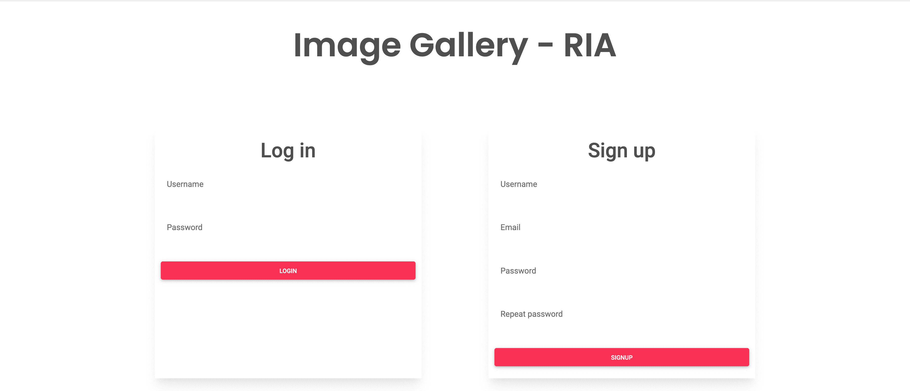
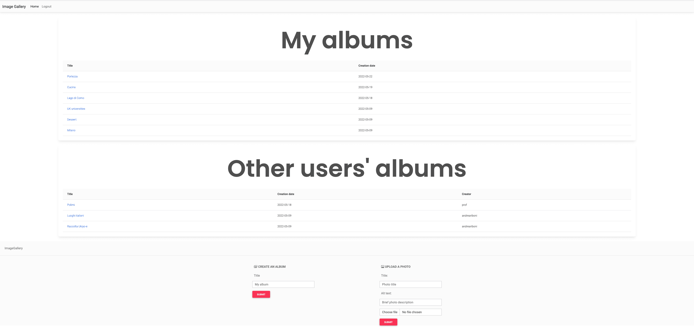
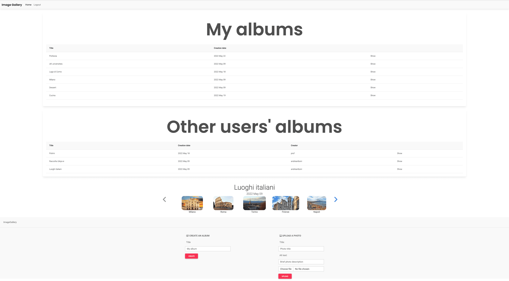
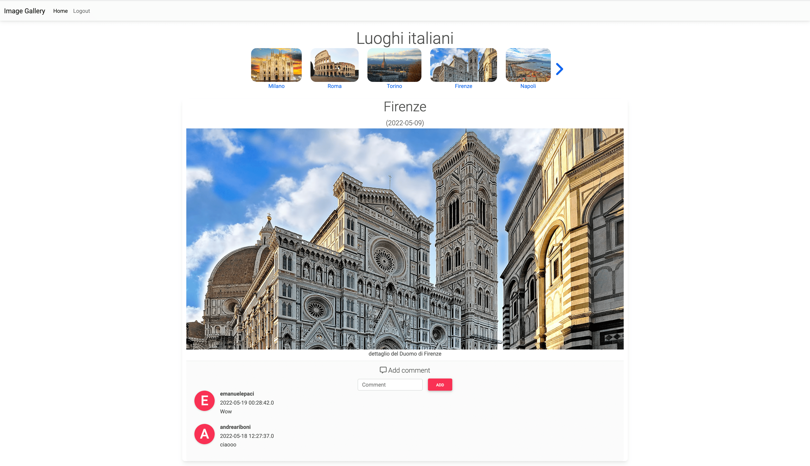
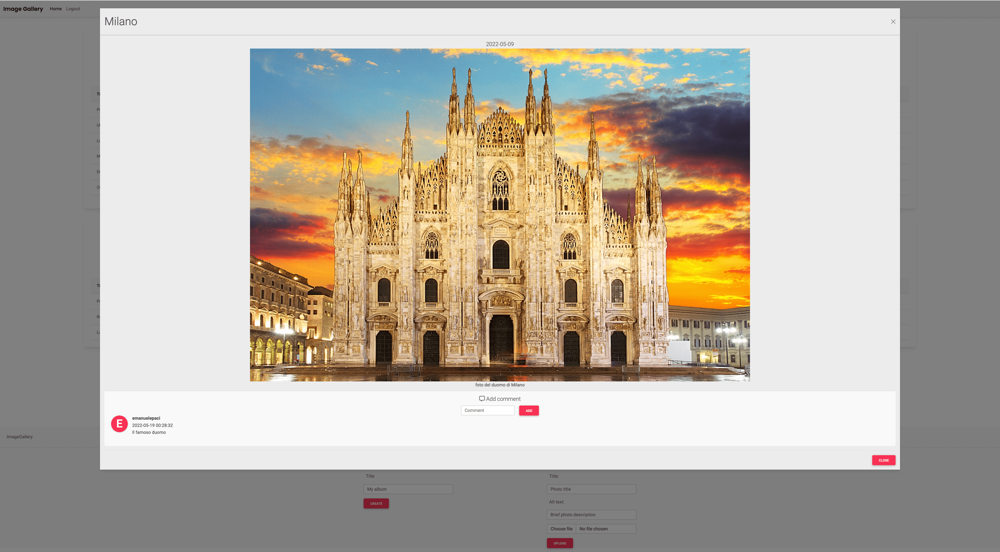

# Web-App-Project-TIW-2022-Paci-Riboni

## About

Image Gallery is the final project for the course **"Technologies for the Web"** at Politecnico di Milano (2021/2022)

Final Score: 30/30

## Programming Languages 

## Frameworks

## Professors

* Piero Fraternali
* Federico Milani (Tutor)
* Nicolò Oreste Pinciroli (Tutor)

## The Team

* [Emanuele Paci](https://github.com/emanuelePaci)
* [Andrea Riboni](https://github.com/AndreaRiboni)

## Specifications

The objective of the project is the implementation of a **web application** simulating an online image gallery website in two distinct versions:
### Pure HTML
A thin client application connected to a **JAVA** server that communicates with an **SQL** database. The combination of **HTML + Thymeleaf + CSS** is used for the web pages;
### RIA (Rich Internet Application)
A thick client application using **JavaScript(JS)** connected to a **JAVA** server that communicates with an **SQL** database. The web pages are managed client-side with a combination of **HTML + JavaScript(JS) + CSS**;

## Media
- Login
 

- Homepage Pure HTML
 

- Homepage RIA
 

- Album Page Pure HTML
 

- Popup RIA
 
